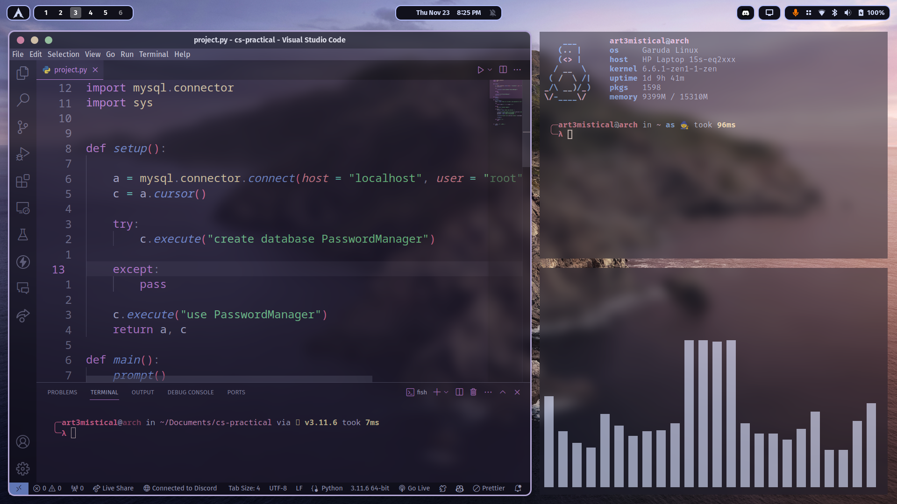

# Dotfiles
 
 # Old rices are on releases page
 
# Preview:

# Extensions:
<a href='https://extensions.gnome.org/extension/4481/forge/'> Forge </a>
 
<a href='https://extensions.gnome.org/extension/4451/logo-menu/'> Logo Menu </a>
 
<a href='https://extensions.gnome.org/extension/1460/vitals/'> Vitals </a>
 
<a href='https://extensions.gnome.org/extension/3193/blur-my-shell/'> Blur My Shell </a>
 
<a href='https://extensions.gnome.org/extension/5090/space-bar/'> Space Bar </a>
 
<a href='https://extensions.gnome.org/extension/4356/top-bar-organizer/'> Top Bar Organizer </a>

## Music player: <a href = 'https://flathub.org/apps/details/io.bassi.Amberol'> Amberol </a>
